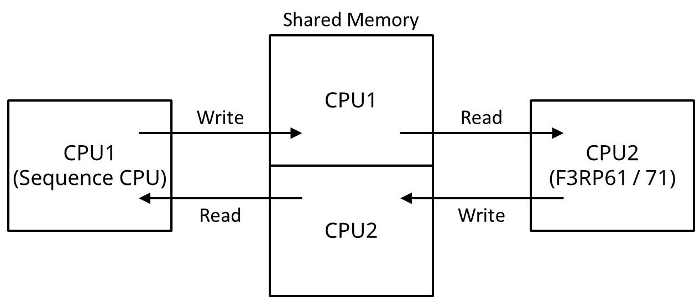

Device and Driver Support for F3RP71 and F3RP61
===============================================

Table Of Contents
=================
<!--ts-->
   * [Device and Driver Support for F3RP71 and F3RP61](#device-and-driver-support-for-f3rp71-and-f3rp61)
   * [Table Of Contents](#table-of-contents)
   * [Overview](#overview)
   * [Device Types](#device-types)
   * [Supported Record Types](#supported-record-types)
   * [Accessing I/O Module](#accessing-io-module)
      * [Accessing Input Relay (X)](#accessing-input-relay-x)
      * [Accessing Output Relay (Y)](#accessing-output-relay-y)
      * [Accessing Data Register](#accessing-data-register)
         * [Using 'unsigned' value option](#using-unsigned-value-option)
         * [Using 'binary-coded-decimal (BCD)' option](#using-binary-coded-decimal-bcd-option)
         * [Read an array of data](#read-an-array-of-data)
      * [Accessing Mode Register](#accessing-mode-register)
   * [Handling Special Module](#handling-special-module)
   * [Important Notice on Using F3RP71 in Multi-CPU Configuration](#important-notice-on-using-f3rp71-in-multi-cpu-configuration)
   * [Communication with Sequence CPU](#communication-with-sequence-cpu)
      * [Communication Based on Shared Memory](#communication-based-on-shared-memory)
         * [Communication Based on Shared Memory Using New Interface<a name="user-content-UsingNewInterface"></a>](#communication-based-on-shared-memory-using-new-interface)
            * [Notes on Using Shared Memory with F3RP71 (<strong>not</strong> F3RP61)<a name="user-content-SharedMemoryWithF3RP71"></a>](#notes-on-using-shared-memory-with-f3rp71-not-f3rp61)
            * [Reading/Writing Shared Relays (1-bit variables)](#readingwriting-shared-relays-1-bit-variables)
            * [Reading/Writing  Shared Registers (16-bit variables)](#readingwriting--shared-registers-16-bit-variables)
         * [Communication Based on Shared Memory Using Old Interface](#communication-based-on-shared-memory-using-old-interface)
      * [Accessing Internal Device of Sequence CPU](#accessing-internal-device-of-sequence-cpu)
   * [I/O Interrupt Support](#io-interrupt-support)
   * [FL-net Support](#fl-net-support)
   * [LED / Rotary Switch / Status Register support](#led--rotary-switch--status-register-support)
      * [LED support](#led-support)
      * [Rotary switch support](#rotary-switch-support)
      * [Status register support](#status-register-support)

<!-- Added by: shuei, at: 2019-02-27T18:04+09:00 -->

<!--te-->


# Overview

This device / driver support can be used to run EPICS iocCore on an
embedded Linux controller, F3RP71 (e-RT3 plus) and F3RP61 (e-RT3 2.0),
made by Yokogawa Electric Corporation. Both F3RP71 and F3RP61 are able
to access most of the I/O modules of the FA-M3 PLC on the
PLC-bus. This feature opens way for making an FA-M3 PLC itself a new
type of IOC. The device / driver support provides interfaces for
iocCore to access I/O modules as well as ordinary sequence CPUs that
works on the PLC-bus. The device / driver support is implemented by
wrapping the APIs of the kernel-level driver and the user level
library, which are included in the Board Support Package (BSP)
provided by Yokogawa. Read [Install.md](Install.md) for installation
instruction.


As to I/O modules, the device / driver support offers only primitive
method to access the relays and registers. In the sense that any
relays and registers of a supported I/O module can be accessed by
using the device / driver support, it is universal. However, in order
to handle a special module that requires some sequence logic to
execute I/O operation, such as motion control module, the sequence
logic needs to be implemented by using an EPICS sequencer program by
the user. The sequence logic to handle a special module is
implemented by using a ladder program when a sequence CPU is used to
execute the I/O operation. The EPICS sequencer program is used to
replace the ladder program. See [Handling Special
Module](#handling-special-module) for more detail. If some
initialization is required on a special module, it can be done by
using an EPICS sequencer program, or a run-time database comprised of
records that have the PINI field value of "YES".


An F3RP71/F3RP61 works as an IOC either with or without sequence CPUs
which run ladder programs. If there is no sequence CPU on the PLC-bus,
F3RP71/RP61 should manage all the I/O activities. If one of more
sequence CPUs attached to the PLC-bus, some of I/O modules can be
controlled by sequence CPUs, while the others by F3RP71. It is
recommended that those I/O modules under the control of the sequence
CPU be indirectly accessed by the IOC (F3RP71) via the internal
devices of the sequence CPUs. See [Important Notice on Using F3RP71 in
Multi-CPU
Configuration](#important-notice-on-using-f3rp71-in-multi-cpu-configuration)
for more detail.


Digital input modules of FA-M3 can interrupt CPUs upon a change of the
state of the input signal. The BSP has a function that transforms the
interrupt into a message to a user-level process running on it. Based
on this function, the device / driver support supports processing
records upon an I/O interrupt.

# Device Types

In order to use the device / driver support, the device type (DTYP) field of the
record must be set to either:

* "**F3RP61**" for accessing relays and registers of I/O modules, and
  a shared memory,
* "**F3RP61Seq**" for accessing internal devices ("D", "I", "B") of
  the sequence CPUs on the same base unit, or
* "**F3RP61SysCtl**" for controlling status LEDs and/or reading rotary
   switch position of F3RP71 module.

Note that F3RP71 also uses F3RP61, F3RP61Seq, and F3RP61SysCtl for its
device type.

# Supported Record Types

The table below shows the supported device type along with the
relevant record types.

| **Device** | **Description**                         | **Type** | **Length** | **Supported record types**                                                    |
|------------|-----------------------------------------|----------|------------|-------------------------------------------------------------------------------|
| X          | Input relays on input module            | IO       | 1-bit      | mbbi, mbbiDirect, longin, bi, ai                                              |
| Y          | Output relays on output module          | IO       | 1-bit      | mbbi, mbbo, mbbiDirect, mbboDirect, longin, longout, bi, bo, ai, ao           |
| A          | Internal registers on I/O modules       | IO       |            | mbbi, mbbo, mbbiDirect, mbboDirect, longin, longout, ai, ao, si, so, waveform |
| M          | Mode registers                          | IO       |            | mbbi, mbbo, mbbiDirect, mbboDirect                                            |
| R          | Shared registers                        | Shared   | 16-bit     | mbbi, mbbo, mbbiDirect, mbboDirect, longin, longout, ai, ao, waveform         |
| R ext      | Extended shared registers               | Shared   | 16-bit     | mbbi, mbbo, mbbiDirect, mbboDirect, longin, longout, ai, ao, waveform         |
| E          | Shared relays                           | Shared   | 1-bit      | mbbi, mbbo, mbbiDirect, mbboDirect, bi, bo                                    |
| E ext      | Extended shared relays                  | Shared   | 1-bit      | mbbi, mbbo, mbbiDirect, mbboDirect, bi, bo                                    |
| D          | Data registers                          | Internal | 16-bit     | mbbi, mbbo, mbbiDirect, mbboDirect, longin, longout                           |
| Z          | Special registers                       |          | 16-bit     |                                                                               |
| V          | Index registers                         |          | 16-bit     |                                                                               |
| B          | File registers                          | Internal | 16-bit     | mbbi, mbbo, mbbiDirect, mbboDirect, longin, longout                           |
| F          | Cache registers                         |          | 16-bit     |                                                                               |
| L          | Link relays (for FA Link and FL-net)    |          | 1-bit      | mbbi, mbbo, mbbiDirect, mbboDirect, bi, bo                                    |
| W          | Link registers (for FA Link and FL-net) |          | 16-bit     | mbbi, mbbo, mbbiDirect, mbboDirect, longin, longout, ai, ao, waveform         |
| M          | Special relays – read-only              |          | 1-bit      |                                                                               |
| T          | Timers                                  |          |            |                                                                               |
| C          | Counters                                |          |            |                                                                               |
| I          | Internal relays                         | Internal |            | bi, bo                                                                        |

The table below shows supported record types with DTYP fields used to
access specific devices. Each record type by default supports 'no
option' case for all DTYPs. However, in some cases, additional
options are available. Those options are as follows:
* U – unsigned
* L – long
* B – binary-coded-decimal (BCD)
* D – double
* F – float

They can be used as listed in the table below. Device "r" represents
accessing shared registers using 'old interface'.

| **Record type** | **DTYP**     | **Supported device**                      | **Additional option supported**                                                         |
|-----------------|--------------|-------------------------------------------|-----------------------------------------------------------------------------------------|
| mbbi            | F3RP61       | X, Y, A, r, W, L, M, R, E                 |                                                                                         |
| mbbi            | F3RP61Seq    | D, B, F                                   |                                                                                         |
| mbbi            | F3RP61SysCtl | Rotary Switch position                    |                                                                                         |
| mbbo            | F3RP61       | Y, A, r, W, L, M, R, E                    |                                                                                         |
| mbbo            | F3RP61Seq    | D, B, F                                   |                                                                                         |
| mbbiDirect      | F3RP61       | X, Y, A, r, W, L, M, R, E                 |                                                                                         |
| mbbiDirect      | F3RP61Seq    | D, B, F                                   |                                                                                         |
| mbboDirect      | F3RP61       | Y, A, r, W, L, M, R, E                    |                                                                                         |
| mbboDirect      | F3RP61Seq    | D, B, F                                   |                                                                                         |
| longin          | F3RP61       | X, Y                                      | U, L                                                                                    |
| longin          | F3RP61       | W, R                                      | U, L, B                                                                                 |
| longin          | F3RP61       | A                                         | U, L, B ; **note**: L option for 'A' register is supposed to use with XP01/XP02 module  |
| longin          | F3RP61       | r                                         | U, B                                                                                    |
| longin          | F3RP61Seq    | D, B, F                                   | U, L, B                                                                                 |
| longout         | F3RP61       | Y                                         | U, L                                                                                    |
| longout         | F3RP61       | W, R                                      | U, L, B                                                                                 |
| longout         | F3RP61       | A                                         | U, L, B ; **note**: L option for 'A' register is supposed to use with XP01/XP02 module  |
| longout         | F3RP61       | r                                         | U, B                                                                                    |
| longout         | F3RP61Seq    | D, B, F                                   | U, L, B                                                                                 |
| bi              | F3RP61       | X, Y, L, E                                |                                                                                         |
| bi              | F3RP61Seq    | I                                         |                                                                                         |
| bi              | F3RP61SysCtl | LEDs: R, A, E, 1, 2, 3; System Stat. Reg. |                                                                                         |
| bo              | F3RP61       | Y, L, E                                   |                                                                                         |
| bo              | F3RP61Seq    | I                                         |                                                                                         |
| bo              | F3RP61SysCtl | LEDs: R, A, E, 1, 2, 3                    |                                                                                         |
| ai              | F3RP61       | X, Y                                      | U, L, F, D                                                                              |
| ai              | F3RP61       | W, R                                      | U, L, F, D                                                                              |
| ai              | F3RP61       | A                                         | U, L ; **note**: L option for 'A' register is supposed to use with XP01/XP02 module     |
| ai              | F3RP61       | r                                         | U                                                                                       |
| ai              | F3RP61Seq    | D, B, F                                   | U, L, F, D                                                                              |
| ao              | F3RP61       | Y                                         | U, L, F, D                                                                              |
| ao              | F3RP61       | W, R                                      | U, L, F, D                                                                              |
| ao              | F3RP61       | A                                         | U, L ; **note**: L option for 'A' register is supposed to use with XP01/XP02 module     |
| ao              | F3RP61       | r                                         | U                                                                                       |
| ao              | F3RP61Seq    | D, B, F                                   | U, L, F, D                                                                              |
| si              | F3RP61       | A                                         |                                                                                         |
| so              | F3RP61       | A                                         |                                                                                         |
| waveform        | F3RP61       | A                                         | **FTVL field**: DBF\_ULONG, DBF\_USHORT, DBF\_SHORT                                     |
| waveform        | F3RP61       | r, W, R                                   | **FTVL field**: DBF\_DOUBLE, DBF\_FLOAT, DBF\_LONG, DBF\_ULONG, DBF\_SHORT, DBF\_USHORT |


# Accessing I/O Module
## Accessing Input Relay (X)

Input relays are read-only devices. Binary input (bi) records,
multi-binary input direct (mbbiDirect) records, long input (longin)
records and analog input (ai) records are supported by the device
support. The three numbers, a unit number, a slot number and an input
relay number must be specified in the INP field as the following
example shows.

```
record(bi, "f3rp61_example_1") {
    field(DTYP, "F3RP61")
    field(INP, "@U0,S2,X1")
}
```

The above record reads a value of either "on" (1) or "off" (0) from
the first input relay (X1) of an I/O module in the second slot (S2) of
the main unit (U0).

The next example shows how to read 16 bits of status data on a group
of input relays by using an mbbiDirect record.

```
record(mbbiDirect, "f3rp61_example_2") {
    field(DTYP, "F3RP61")
    field(INP, "@U0,S2,X1")
}
```

In this case, the number "1" as in "X1" specifies the first relay to
read. The status bits on the 16 relays, X1, X2, ... , X16 are read into
the B0, B1, ... , BF fields of the mbbiDirect record.

The next example shows how to read a digital value of 16 bits on a
group of input relays which represents a state from a range of up to
16 states by using an mbbi record.

```
record(mbbi, "f3rp61_example_3") {
    field(DTYP, "F3RP61")
    field(INP, "@U0,S2,X1")
    field(ZRVL, "0")
    field(ZRST, "OFF")
    field(ONVL, "1")
    field(ONST, "ON")
    field(TWVL, "2")
    field(TWST, "Idle")
    field(THVL, "4")
    field(THST, "Error")
}
```

In this case, it is assumed that the Least Significant Bit (LSB) is on
X1 and the Most Significant Bit (MSB) is on X16, and the digital value
on the input relays is assumed to be unsigned short. The unsigned
short value is set to RVAL field to determine the current state of
this record out of 4 states. For example, when the unsigned short
value is 4, this record represents "Error" state.

The next example shows how to read a digital value of 16 bits on a
group of input relays by using longin records.

```
record(longin, "f3rp61_example_4") {
    field(DTYP, "F3RP61")
    field(INP, "@U0,S2,X1")
}
```

In this case, it is assumed that the Least Significant Bit (LSB) is on
X1 and the Most Significant Bit (MSB) is on X16, and the digital value
on the input relays is assumed to be signed short. If the value is
unsigned short, "&U" must follow the relay number as follows.

```
record(longin, "f3rp61_example_5") {
    field(DTYP, "F3RP61")
    field(INP, "@U0,S2,X1&U")
}
```

The rules explained in the last two examples apply to the ai
record. The value read from the input relays goes into the raw value
(RVAL) field of the ai record.

##  Accessing Output Relay (Y)

Output relays are read-write devices. Just replacing "X" with "Y"
in the INP fields of the example records shown in the previous
subsection suffices to read output relays.

In order to write output relays, binary output (bo) records, multi-bit
binary output direct (mbboDirect) records, long output (longout)
records, and analog output (ao) records can be used. The following
example shows how to write an output relay by using a bo record.

```
record(bo, "f3rp61_example_6") {
    field(DTYP, "F3RP61")
    field(OUT, "@U0,S2,Y1")
}
```

The above record writes a value of either "on" (1) or "off" (0) onto
the first output relay (Y1) of an I/O module in the second slot (S2)
of the main unit (U0).

The next example shows how to write 16 bits of data onto a group of
output relays by using an mbboDirect record.

```
record(mbboDirect, "f3rp61_example_7") {
    field(DTYP, "F3RP61")
    field(OUT, "@U0,S2,Y1")
}
```

In this case, the number in "Y1" specifies the first relay to
write. The 16-bits data of the mbboDirect record, B0, B1, ... , BF, are
written onto the output relays, Y1, Y2, ... , Y16 respectively.

The next example shows how to write a value of 16 bits onto a group of
output relays by using an mbbo record.

```
record(mbbo, "f3rp61_example_8") {
    field(DTYP, "F3RP61")
    field(OUT, "@U0,S2,Y1")
    field(ZRVL, "0")
    field(ZRST, "Stop")
    field(ONVL, "1")
    field(ONST, "Play")
    field(TWVL, "2")
    field(TWST, "Pause")
    field(THVL, "4")
    field(THST, "Forward")
    field(FRVL, "8")
    field(FRST, "Back")
}
```

In this case, it is assumed that the Least Significant Bit (LSB) goes
onto Y1 and the Most Significant Bit (MSB) goes onto Y16, and the
value is unsigned short. The value set to VAL field is considered as
an index of one of 5 states. If VAL is set to 3 which represents
"Forward", RVAL is set to 4 according to THVL, and then the value in
RVAL is finally written to Y1 - Y16 as an unsigned short value.

The next example shows how to write a value of 16 bits onto a group of
output relays by using a longout record.

```
record(longout, "f3rp61_example_9") {
    field(DTYP, "F3RP61")
    field(OUT, "@U0,S2,Y1")
}
```

In this case, it is assumed that the Least Significant Bit (LSB) goes
onto Y1 and the Most Significant Bit (MSB) goes onto Y16, and the
value is signed short. If the value is unsigned short, "&U" must
follow the relay number as follows.

```
record(longout, "f3rp61_example_10") {
    field(DTYP, "F3RP61")
    field(OUT, "@U0,S2,Y1&U")
}
```

The rules explained in the last two examples apply to the ao
record. The value in the raw value (RVAL) field of the ao record is
written onto the output relays.

##  Accessing Data Register

Analog I/O modules and other special modules, such as motion control
modules, etc., have many registers to hold the I/O data and relevant
parameters. In order to read / write these registers, longin /
longout, ai / ao and mbbiDirect / mbboDirect records are
supported. While some of the registers hold 32-bit data, the device /
driver support supports only reading / writing a value of 16
bits. 32-bit registers must be read / written, according to the
specification of the I/O module, by using two records, one for the
upper half and the other for the lower half of the 32 bits of the
value.

The following example shows how to use a longin record to read a
16-bit register.

```
record(longin, "f3rp61_example_11") {
    field(DTYP, "F3RP61")
    field(INP, "@U0,S3,A1")
}
```

The above record reads a value of 16-bit data from the first register
(A1) of a module in the third slot (S3) of the main unit (U0).

The following example shows how to use a longout record to write a
16-bit register.

```
record(longout, "f3rp61_example_12") {
    field(DTYP, "F3RP61")
    field(OUT, "@U0,S3,A1")
}
```

The above record writes a value of 16-bit data onto the first register
(A1) of a module in the third slot (S3) of the main unit (U0).

The rules in the above two examples apply to ai /ao, mbbiDirect /
mbboDirect records. The value read from (written onto) the device
comes in (goes out) via the RVAL field of the records.

### Using 'unsigned' value option

As to longin and ai type records, the "&U" option can be specified at
the end of the INP field to read unsigned 16-bit data as shown below.

```
record(longin, "f3rp61_example_13") {
    field(DTYP, "F3RP61")
    field(INP, "@U0,S3,A1&U")
}
```

### Using 'binary-coded-decimal (BCD)' option

As to longin and longout type records, "&B" option can be specified at
the end of INP or OUT field.

In case of input record, 16-bit BCD data (0 – 9999) read from the
device is converted to unsigned integer value and stored in the VAL
field of the record. If the data from the device includes an invalid
hexadecimal number (A – F), the invalid number is rounded to 9, and
the alarm severity and the alarm status are set to INVALID / HIGH.

In case of output record, integer value in VAL field is converted to
16-bit BCD data (0 – 9999) and sent to the device. When the value is
sent to the device, the value in VAL field higher than 9999 is rounded
to 9999, and the negative value is rounded to 0. If the values is
rounded to either 9999 or 0, the alarm severity and the alarm status
are set to INVALID / HW\_LIMIT.

Usage is shown below.

```
record(longin, "f3rp61_example_14") {
    field(DTYP, "F3RP61")
    field(INP, "@U0,S3,A1&B")
}
record(longout, "f3rp61_example_15") {
    field(DTYP, "F3RP61")
    field(OUT, "@U0,S3,A1&B")
}
```

### Read an array of data

Waveform type records are supported to read out an array of data from
the registers of I/O intelligent modules. The allowed values of FTVL
(Field Type of VaLue) are SHORT, USHORT, and ULONG.

The following example shows how to read successive 8 registers of an
intelligent module in Slot 3 of Unit 0. The address, A1, specifies the
first register to read.

```
record(waveform, "f3rp61_example_16") {
    field(DTYP, "F3RP61")
    field(INP, "@U0,S3,A1")
    field(FTVL, "SHORT")
    field(NELM, "8")
}
```

## Accessing Mode Register

Non-intelligent digital I/O modules have mode registers to hold the
scan rates, interrupt raising conditions (rising edge / falling edge),
filtering conditions of the I/O channels. In order to access the mode
registers, an mbbiDirect /mbboDirect record can be used with a
character for addressing, "M", in the INP / OUT field of the records.

The following example shows how to use an mbbiDirect record to read a
16-bit register.

```
record(mbbiDirect, "f3rp61_example_17") {
    field(DTYP, "F3RP61")
    field(INP, "@U0,S3,M1")
}
```

The above record reads a value of 16-bit data from the first mode
register (M1) of a non-intelligent digital I/O module in the third
slot (S3) of the main unit (U0).

The following example shows how to use an mbboDirect record to write a
16-bit register.

```
record(mbboDirect, "f3rp61_example_18") {
    field(DTYP, "F3RP61")
    field(OUT, "@U0,S3,M1")
}
```

The above record writes a value of 16-bit data into the first mode
register (M1) of a non-intelligent digital I/O module in the third
slot (S3) of the main unit (U0). For example, if the I/O module is a
digital input module and if you set the B0 field of the above record,
it results in specifying that a part of the I/O channels (from X25 to
X32) of the module raise interrupts upon the falling edge of the input
signals. For more details, please consult relevant hardware manuals
from Yokogawa Electric Corporation.

Note that the mbbo record always outputs a value of zero when the
record gets processed by being written a value into its VAL field
regardless of whatever the value is. The author is not sure if the
behavior is just a specification or a bug of the mbbo record. At any
rate, if you complete setting the conditions on a digital I/O module
bit by bit by using B0, B1, B2, …, BF fields of an mbbo record, you
are free from the problem mentioned above.

# Handling Special Module

This section describes how to handle special modules that require some
sequence logic to execute I/O operations. As an example, we consider a
motion control module that controls the motion of a stepping motor by
sending a train of pulses to the motor driver.

Suppose you drive a motor dedicated to an axis. In the first place,
you make the F3RP71 set the number of pulses (distance to move) into a
register of the motion control module by using longout or ao
record(s). (While the parameter is 32 bit long, the motion control
modules do not support long word (32 bits) read / write operation. Two
records, therefore, are necessary to set the upper 16 bits and the
lower 16 bits.)

Next, you make the F3RP61 turn on an output relay (EXE) to trigger the
action. This can be performed by putting the value of one (1) into the
VAL field of the following record. (The relay number varies from type
to type. The following example records are just for illustration. See
the manual of the module you use for more detailed information. We
assume the motion control module is in slot 4.)

```
record(bo, "f3rp61_motion_exe") {
    field(DTYP, "F3RP61")
    field(OUT, "@U0,S4,Y33")
}
```

The motion control module will respond to the EXE command by turning
on an input relay (ACK) if no error is found in the parameters
given. The F3RP61 needs to check the ACK by using a record shown
below.

```
record(bi, "f3rp61_motion_ack") {
    field(SCAN, ".1 second")
    field(DTYP, "F3RP61")
    field(INP, "@U0,S4,X1")
}
```

And then, the operation (sending pulses) starts. The F3RP61 is
required to turn off the EXE after the ACK is turned on. The motion
control module, then, turns off the ACK after the EXE is turned off.

When the operation (sending pulses) completes, the motion control
module informs the F3RP61 of the completion by turning on yet another
input relay (FIN). Just like the ACK, the FIN needs to be checked by
using a record shown below.

```
record(bi, "f3rp61_motion_fine") {
    field(SCAN, ".1 second")
    field(DTYP, "F3RP61")
    field(INP, "@U0,S4,X5")
}
```

Note that the records to monitor the input relays must be processed
periodically. You might want to choose to use the interrupt support
explained in section 7 instead of periodic scanning, though the author
has not yet tried it in using motion control modules.

The essential part of the EPICS sequencer program to manage the
sequence described above in words will look like as follows.

```
int exe;
in ack;
int fin;
assign exe f3rp61_motion_exe;
assign ack f3rp61_motion_ack;
assign fin f3rp61_motion_fin;
monitor exe;
monitor ack;
monitor fin;
ss exe_move {
    state wait_exe {
        when (exe) {
        } state wait_ack
    }

    state wait_ack {
        when (ack) {
            exe = FALSE;
            pvPut(exe);
        } state wait_fin
    }

    state wait_fin {
        when(fin) {
        } state wait_exe
    }
}
```

The author reminds you that the above example is just for
illustration. The sequencer program for the real operation involves a
little bit more to handle other types of commands for the motion
control module, and to handle exceptions that can occur in the
sequence (for example, an error caused by a wrong parameter set by the
user).

# Important Notice on Using F3RP71 in Multi-CPU Configuration

This section gives you an important notice on using an F3RP71/F3RP61
CPU together with sequence CPUs on the same unit.

A typical use case of multi-CPU configuration is a sequence CPU
implementing an interlock logic which requires high reliability, and
F3RP71 controlling or monitoring the interlock system. In such a case,
one have to pay attention to the following two points:

- The sequence CPU must be in the first slot (slot 1). The CPU in the
  first slot becomes the master of the unit, which resets the whole
  system upon rebooting.
- The F3RP71 should NOT access, regardless of read or write, to those
  I/O modules used by the sequence CPU for the interlock system.

The reason of the second point is as follows. If an I/O module is
accessed by an F3RP71 CPU, the I/O module recognizes and remembers
that the F3RP71 CPU is one of its masters. When the Linux system on
the F3RP71 CPU is rebooted, the F3RP71 CPU broadcasts the fact by
using a signal on the PLC-bus. The I/O modules that have been accessed
by the F3RP71 CPU and recognize it as one of their masters reset
themselves when they detect the signal. It makes the I/O modules
inaccessible by the sequence CPU and makes the ladder program stop
with I/O errors. For this reason, it is highly recommended that you
make the F3RP71 CPU read the status of interlock indirectly via some
internal devices ("I", "D", "B") of the sequence CPU or, through the
shared memory ("E", "R") by using a method described in the next
section.

On the other hand, if one or more I/O modules are used with an F3RP71
CPU for some control in the multi-CPU configuration, you need to tell
the sequence CPU not to touch the I/O modules under the F3RP71 CPU's
control. This setting can be done on the sequence CPU by using the
ladder development software, WideField3 (or WideField2). From the menu
of your "Project", select "Configuration" and then, select "DIO
Setup". Change the default setup from "Use" to "Not used" for the I/O
modules. Otherwise, the sequence CPU overwrites the data of the output
channels of the modules with the value of zero even when any I/O
execution commands on the I/O modules do not appear explicitly in the
ladder program.

# Communication with Sequence CPU

Two different types of methods are supported for an F3RP71 to
communicate with sequence CPUs that work on the same base unit. One is
shared-memory-based communication and the other is message-based
communication. The former is synchronous access that finishes
instantly, just like the access to the I/O relays and registers of an
I/O module. The latter is asynchronous and takes a few milliseconds to
complete. For this reason, two different DTYPs are defined in the
device / driver support, namely "F3RP61" for the former (synchronous)
and "F3RP61Seq" for the latter (asynchronous).

## Communication Based on Shared Memory

The following is the basics to understand how the communication between F3RP71 CPUs and sequence CPUs works.

* Each CPU, a sequence CPU or an F3RP71 CPU can have regions allocated
  to it.
* Any CPU, a sequence CPU or an F3RP71 CPU can write into only the
  regions allocated to it.
* Any CPU, a sequence CPU or an F3RP71 CPU can read out from any
  regions.

In order to make the story simple, we consider a case where only one
sequence CPU in slot 1 works with only one F3RP71 CPU in slot 2 on the
same base unit. From the rules mentioned above, how we use the shared
memory to make the two CPUs communicate with each other is clear. If
the data go from the sequence CPU (CPU1) to the F3RP71 CPU (CPU2), use
the area allocated to the sequence CPU (CPU1), and vice versa, as
shown in the figure below.



### Communication Based on Shared Memory Using New Interface<a name="UsingNewInterface"></a>

The device and driver support make use of a set of API for shared
memory (i.e., shared relays and shared registers). This API is
available in F3RP71 BSP (R1.03 or later), as well as in F3RP61 BPS
(R2.01 or later). Calling f3rp61ComDeviceConfigure() prior to
iocInit() in the IOC start-up script (st.cmd) allocates shared memory
for specified CPU:

```shell
f3rp61ComDeviceConfigure(0, 512, 256, 64, 32)
f3rp61ComDeviceConfigure(1, 512, 256, 64, 32)
```

The first line allocates 512 shared relays, 256 words of shared
registers, 64 extended shared relays, and 32 words of extended shared
registers the CPU in slot 1 (e.g., a sequence CPU). The second line
allocates the same numbers of shared relays and shared registers to
the CPU in slot 2 (e.g., F3RP71 CPU).  Note that indices starts from
0. Make sure that arguments to f3rp61ComDeviceConfigure() for the
sequence CPU shall be consistent with Inter-CPU Shared Memory Setup in
WideField3.

#### Notes on Using Shared Memory with F3RP71 (**not** F3RP61)<a name="SharedMemoryWithF3RP71"></a>
Make sure that, when using F3RP71 (**not** F3RP61) in a multi-CPU
configuration, "Non-Simultaneous" is selected for "Shared Refreshed
Data" in Inter-CPU Shared Memory Setup.
Otherwise  even if F3RP71 writes anything to the shared memory, it looks like as if nothing has been modified when read from the sequence CPU.
Refer to following manuals for the detail:
- **IM 34M06M52-02E**, "e-RT3 CPU Module (SFRD␣2) BSP Common Function Manual", 5.2 Shared device
- **IM 34M06Q16-02E**, "FA-M3 Programming Tool WideField3 (Offline)", D3.1.13 Inter-CPU Shared Memory Setup

#### Reading/Writing Shared Relays (1-bit variables)

The following example shows how to read a shared relay by using a bi
record.

```
record(bi, "f3rp61_example_19") {
    field(DTYP, "F3RP61")
    field(INP, "@E1")
}
```

The bi record can be used to read the first shared relay (E1). In this
case, the relay (E1) can be allocated to any CPU as mentioned earlier.

The following example shows how to write a shared relay by using a bo
record.

```
record(bo, "f3rp61_example_20") {
    field(DTYP, "F3RP61")
    field(OUT, "@E1")
}
```

The bo record can be used to write the first shared relay (E1). In
this case, the relay (E1) must be allocated to the F3RP71-based IOC as
mentioned earlier.

#### Reading/Writing  Shared Registers (16-bit variables)

Shared registers are 16-bit variables that can be accessed with
records of the following types:

* longin, longout (available options: "L" - long, "B" - binary-coded-decimal);
* ai, ao (available options: "L", "F" – float, "D" - double);
* mbbi, mbbo;
* mbbiDirect, mbboDirect;
* waveform.

Some types have additional options that describe in what format the
value will be stored in the VAL field of the record. Usage of each
record type and its options are described with the examples below.

The following example shows how to read a shared register by using a
longin record.

```
record(longin, "f3rp61_example_21") {
    field(DTYP, "F3RP61")
    field(INP, "@R1")
}
```

The longin record can be used to read the first shared register
(R1). In this case, the register (R1) can be allocated to any CPU.

The following example shows the usage of "B" option. Shared register
value that is read from a register is regarded as BCD format,
converted to integer value, and then stored in the VAL field as such.


```
record(longin, "f3rp61_example_22") {
    field(DTYP, "F3RP61")
    field(INP, "@R1&B")
}
```

If two registers, say, R1 and R2, are written by a Sequence CPU to
transfer a long word (32-bits) value, it can be read by using the
following record, of which INP field value has the address "@R1" with
the trailing "&L".

```
record(longin, "f3rp61_example_23") {
    field(DTYP, "F3RP61")
    field(INP, "@R1&L")
}
```

The following example shows how to write a shared register by using a
longout record.

```
record(longout, "f3rp61_example_24") {
    field(DTYP, "F3RP61")
    field(OUT, "@R1")
}
```

The longout record can be used to write the first shared register
(R1). In this case, the register (R1) must be allocated to the
F3RP71-based IOC.

The following example shows usage of "B" option. Value in the VAL
field is converted to BCD format and written to a shared register.

```
record(longout, "f3rp61_example_25") {
    field(DTYP, "F3RP61")
    field(OUT, "@R1&B")
}
```

In order to write a long word (32-bits) value onto two registers, say,
R1 and R2, the following record, of which INP field value has the
address "R1" with the trailing "&L", can be used.

```
record(longout, "f3rp61_example_26") {
    field(DTYP, "F3RP61")
    field(OUT, "@R1&L")
}
```

The following example shows how to read a shared register by using an
ai record.

```
record(ai, "f3rp61_example_27") {
    field(DTYP, "F3RP61")
    field(INP, "@R1")
}
```

The ai record can be used to read the first shared register (R1). In
this case, the register (R1) can be allocated to any CPU.

If two registers, say, R1 and R2, are written by a Sequence CPU to
transfer a long word (32-bits) value, it can be read by using the
following record, of which INP field value has the address "@R1" with
the trailing "&L".

```
record(ai, "f3rp61_example_28") {
    field(DTYP, "F3RP61")
    field(INP, "@R1&L")
}
```

If two registers, say, R1 and R2, are written by a Sequence CPU to
transfer a float type (32-bits) value, it can be read by using the
following record, of which INP field value has the address "@R1" with
the trailing "&F".

```
record(ai, "f3rp61_example_29") {
    field(DTYP, "F3RP61")
    field(INP, "@R1&F")
}
```

If four registers, say, R1, R2, R3 and R4, are written by a Sequence
CPU to transfer a double type (64-bits) value, it can be read by using
the following record, of which INP field value has the address "@R1"
with the trailing "&D".

```
record(ai, "f3rp61_example_30") {
    field(DTYP, "F3RP61")
    field(INP, "@R1&D")
}
```

The following example shows how to write a shared register by using an
ao record.

```
record(ao, "f3rp61_example_31") {
    field(DTYP, "F3RP61")
    field(OUT, "@R1")
}
```

The longout record can be used to write the first shared register
(R1). In this case, the register (R1) must be allocated to the
F3RP71-based IOC.

In order to write a long word (32-bits) value onto two registers, say,
R1 and R2, the following record, of which INP field value has the
address "R1" with the trailing "&L", can be used.

```
record(ao, "f3rp61_example_32") {
    field(DTYP, "F3RP61")
    field(OUT, "@R1&L")
}
```

In order to write a float type value (32-bits) onto two registers,
say, R1 and R2, the following record, of which INP field value has the
address "R1" with the trailing "&F", can be used.

```
record(ao, "f3rp61_example_33") {
    field(DTYP, "F3RP61")
    field(OUT, "@R1&F")
}
```

In order to write a double type value (64-bits) onto four registers,
say, R1, R2, R3 and R4, the following record, of which INP field value
has the address "R1" with the trailing "&D", can be used.

```
record(ao, "f3rp61_example_34") {
    field(DTYP, "F3RP61")
    field(OUT, "@R1&D")
}
```

Waveform type records are supported to read out an array of data from
shared registers. The value of FTVL (Field Type of VaLue) must match
with the type of the data written by the Sequence CPU.

The following example shows how to read successive 256 float values
(on 512 words of registers). The address, R1, specifies the first
address of the successive registers to read.

```
record(waveform, "f3rp61_example_35") {
    field(DTYP, "F3RP61")
    field(INP, "@R1")
    field(FTVL, "FLOAT")
    field(NELM, "256")
}
```

MbbiDirect /mbboDirect and mbbi / mbbo are also supported to read /
write the shared registers.

### Communication Based on Shared Memory Using Old Interface

The author recommends that you choose the method to access the shared
memory (shared relays and shared registers) based on the new APIs
since it is much easier to understand. The device /driver support,
however, still supports accessing the shared memory based on the old
APIs for backward compatibility. If you choose this option, you need
to know the following points.

* While a sequence CPU can access shared relays bit by bit, an F3RP61
    CPU can access the shared relays only by word.
* The specification of the INP / OUT fields is different from that
    explained in [Using New Interface](#UsingNewInterface).
* You need to understand the address map shown below.

In order to make the story simple, we consider a case where we have
only two CPUs, a sequence CPU in slot 1 (CPU1) and an F3RP61 CPU in
slot 2 (CPU2). In addition, we assume that we allocate 512 bits (32
words) of shared relays and 256 words of shared registers to both CPU1
(a sequence CPU) and CPU2 (an F3RP61 CPU). In this case, the F3RP61
gets to see the following flat memory space, of which address starts
with zero (the first "R00000" of the left most column).

```
---------------------------------------------------------------------------------------------
R00000: E00001 – E00016 Allocated to CPU1 (sequence CPU)
R00001: E00017 – E00032
R00002: E00033 – E00048
...
R00031: E00497 – E00512
---------------------------------------------------------------------------------------------
R00032: E00513 – E00528 Allocated to CPU2 (F3RP61 CPU)
R00033: E00529 – E00544
R00034: E00545 – E00560
...
R00063: E00497 – E01024
---------------------------------------------------------------------------------------------
R00064: R00001 Allocated to CPU1 (sequence CPU)
R00065: R00002
R00066: R00003
...
R00319: R00256
---------------------------------------------------------------------------------------------
R00320: R00257 Allocated to CPU2 (F3RP61 CPU)
R00321: R00258
R00322: R00259
...
R00575: R00512
---------------------------------------------------------------------------------------------
```

The following record allows the F3RP61 CPU to read the first 16 bits
of shared relays (E00001 –E00016) all at once.

```
record(mbbiDirect, "f3rp61_example_36") {
    field(DTYP, "F3RP61")
    field(INP, "@CPU1,R0")
}
```

Note that, in this case, the address you need to specify in the INP
field is the left most number in the mapping table shown above. The bi
record is not supported to read a shared relay because CPU2 (F3RP61
CPU) can access shared relays only by word when you choose the
old-API-based access.

Similarly, the first shared register allocated to CPU1 (sequence CPU)
can be read by using the following record.

```
record(mbbiDirect, "f3rp61_example_37") {
    field(DTYP, "F3RP61")
    field(INP, "@CPU1,R64")
}
```

Both R0 and R64 in the last two examples cannot be written by the CPU2
(F3RP61 CPU) since they are allocated to CPU1 (sequence CPU).

Next, we consider CPU2 (F3RP61 CPU) writing a value into a region
allocated to it.

```
record(mbboDirect, "f3rp61_example_38") {
    field(DTYP, "F3RP61")
    field(OUT, "@CPU2,R32")
}
```

On the CPU1 (sequence CPU)-side, it gets to see a write onto 16 bits
of shared relays (E00513 – E00528) occur all at once upon the above
record processing.

Similarly, the first shared register allocated to CPU2 (F3RP61 CPU)
can be written by using the following record.

```
record(mbboDirect, "f3rp61_example_39") {
    field(DTYP, "F3RP61")
    field(OUT, "@CPU2,R320")
}
```

Needless to say, CPU2 (F3RP61 CPU) can read back the data written from
both R32 (E00513 – E00528) and R320 (R00257) by using an appropriate
input type record.

You might think that there is no reason for specifying the CPU-numbers
in the INP fields of the examples shown above since the F3RP61 CPU
sees the shared memory as a single flat memory space starting with the
first address of zero. However, we do need to specify the CPU-numbers
as shown in the examples. We do not discuss it any more since it is a
bit complicated story.

Ai / ao and longin / longout, are also supported to read / write the
shared registers.

## Accessing Internal Device of Sequence CPU

The alternative method for an F3RP71 to communicate with a sequence
CPU is to use the message-based transaction. It enables an F3RP71 to
access internal relays and registers of Sequence CPU. Currently
supported by the device support are internal relays "I", internal
registers "D" and internal file registers "B".

Record types that support access to internal relays are bi and bo.

The following example shows how to set (1)/ reset (0) an internal
relay ("I"), say, "I4", of CPU1 (a sequence CPU in slot 1).

```
record(bo, "f3rp61_example_40") {
    field(DTYP, "F3RP61Seq")
    field(OUT, "@CPU1,I4")
}
```

Note that the device type must be "F3RP61Seq" in this case. In order
to read back the result, you can use the following record.

```
record(bi, "f3rp61_example_41") {
    field(DTYP, "F3RP61Seq")
    field(INP, "@CPU1,I4")
}
```

Record types that provide access to internal registers "D" and file
registers "B" are:

* longin, longout,
* ai, ao,
* mbbi, mbbo,
* mbbiDirect, mbboDirect.

Record types longin/longout support a BCD (binary-coded-decimal)
option. Usage and detailed explanation are provided with the examples
below.

In order to write a data register ("D"), say, "D7", of CPU1 (a
sequence CPU in slot 1), the following record can be used.

```
record(longout, "f3rp61_example_42") {
    field(DTYP, "F3RP61Seq")
    field(OUT, "@CPU1,D7")
}
```

Again, the result can be read back by using the following record.

```
record(longin, "f3rp61_example_43") {
    field(DTYP, "F3RP61Seq")
    field(INP, "@CPU1,D7")
}
```

The following example shows the usage of "B" option. Shared register
value that is read from a register is regarded as BCD format,
converted to integer value, and then stored in the VAL field as such.

```
record(longin, "f3rp61_example_44") {
    field(DTYP, "F3RP61Seq")
    field(INP, "@CPU1,D7")
}
```

The following example shows the usage of "B" option for output
record. Value in the VAL field is converted to BCD format and written
to a shared register.

```
record(longout, "f3rp61_example_45") {
    field(DTYP, "F3RP61Seq")
    field(OUT, "@CPU1,D7")
}
```

# I/O Interrupt Support

Digital input modules of FA-M3 can interrupt the F3RP71-based IOC when
they detect a rising edge or falling edge of the input signals. The
kernel-level driver of the BSP can transform the interrupt into a
message to a user-level process. Based on the function, processing
records by I/O interrupt is supported with the device / driver
support. Any records that have the DTYP field value of "F3RP61" and
the SCAN value of "I/O Intr" get processed upon an interrupt on a
specified channel of the specified module. This feature allows you to
trigger a read / write operation by external trigger signals.

Suppose a unit which comprises of an F3RP71 in slot 1, a digital input
module in slot2, and an A/D module in slot 3. The following record
reads the first data register (A1) of the A/D module upon a trigger
input into the first channel (X1) of the digital input module. (The
INP field format takes the form of
"@I/O\_data\_channel:interrupt\_source".)

```
record(ai, "f3rp61_example_46") {
    field(DTYP, "F3RP61")
    field(SCAN, "I/O Intr")
    field(INP, "@U0,S3,A1:U0,S2,X1")
}
```

If you have a D/A module in slot 4, in addition to the module
configuration mentioned above, you can write an output value into the
first data register (A1) of the D/A module upon the same trigger input
by using the following record.

```
record(ao, "f3rp61_example_47") {
    field(DTYP, "F3RP61")
    field(SCAN, "I/O Intr")
    field(OUT, "@U0,S4,A1:U0,S2,X1")
}
```

The following example might seem a little bit strange, but it helps
you see how quick an F3RP71-based IOC can respond to interrupts.

```
record(bi, "f3rp61_example_48") {
    field(DTYP, "F3RP61")
    field(SCAN, "I/O Intr")
    field(INP, "@U0,S2,X1:U0,S2,X1")
}
```

The bi record reads the status (level) of the relay for the trigger
input. Suppose the trigger signal is a pulse and the digital module
generates an interrupt at the rising edge. If the bi record reads the
status before the signal level falls down, the record reads the status
of "on" (1). Otherwise, it reads the status of "off" (0). By changing
the pulse duration with checking the record value, you can roughly
measure the time required for the record to get processed with the
rising edge of the trigger signal as the starting point.

# FL-net Support

There are two different methods in using FL-net. One is based on
message transmission and the other is based on cyclic
transmission. The device / driver support supports only the latter
with fixed link refresh period of 10 milliseconds. It does not support
FL-net in multi-CPU configuration at present. (setM3FlnSysNo() is
called without specifying sysNo in the driver support.)

In order to use FL-net with an F3RP71-based IOC, users need to put the
following IOC command in the startup script for an F3RP71-based IOC to
specify how many link relays and link registers are allocated to each
of the links.

```c
f3rp61LinkDeviceConfigure(0, 512, 256)
f3rp61LinkDeviceConfigure(1, 512, 256)
```

The command needs to be executed prior to the call to iocInit(). The
first line implies that 512 bits of link relays and 256 words of link
registers are allocated to Link1(0 + 1). The next line means that the
same numbers of link relays and link registers are allocated to
Link2(1 + 1). (An F3RP71 CPU can handle up to two FL-net interface
modules, i.e., up to two links though the author have tested only one
link so far.)

Allocation of the link relays and link registers to each of the nodes
on a link needs to be done on a sequence CPU-side by using WideField3
(or WideField2). There is nothing to be done on the F3RP71-based IOC
on this point. Only allocation of the link relays and link registers
to each of the links is needed by using the command described above.

How to make an F3RP71-based IOC communicate with other nodes on a link
is similar with how to make the F3RP71-based IOC communicate with
another CPU on the same base unit through shared memory based on the
new APIs as described in [Using New Interface](#UsingNewInterface).

The following example shows how to read a link relay.

```
record(bi, "f3rp61_example_49") {
    field(DTYP, "F3RP61")
    field(INP, "@L00001")
}
```

The bi record can be used to read the first link relay allocated to a
node on the Link1(0 + 1). The first zero of "L00001" subsequent to the
leading "L" specifies the link1(0 + 1) and the trailing "0001"
specifies the address of the link relay on the link. (The first link
relay of the Link2(1 + 1) can be addressed by "L10001".) In this case,
since it is a read access, the link relay can be allocated to any of
the nodes on the link.

The following example shows how to write a link relay.

```
record(bo, "f3rp61_example_50") {
    field(DTYP, "F3RP61")
    field(OUT, "@L00001")
}
```

The bo record can be used to write the first link relay allocated to a
node on the Link1(0 + 1). In this case, since it is a write access,
the relay must be allocated to the F3RP71-based IOC as a node on the
link.

The following example shows how to read a link register.

```
record(longin, "f3rp61_example_51") {
    field(DTYP, "F3RP61")
    field(INP, "@W00001")
}
```

The longin record can be used to read the first link register
allocated to a node on the Link1(0 + 1). The first zero of "W00001"
subsequent to the leading "W" specifies the link1(0 + 1) and the
trailing "0001" specifies the address of the link register on the
link. (The first link register of the Link2(1 + 1) can be addressed by
"W10001".) In this case, since it is a read access, the link register
can be allocated to any of the nodes on the link.

The following example shows how to write a link register.

```
record(longout, "f3rp61_example_52") {
    field(DTYP, "F3RP61")
    field(OUT, "@W00001")
}
```

The longout record can be used to write the first link register
allocated to a node on the Link1(0 + 1). In this case, since it is a
write access, the register must be allocated to the F3RP71-based IOC
as a node on the link.

In order to read / write long word (32-bits) values by using longin /
longout records, "&L"-option can be used as explained in 6.1.1 in the
case of shared registers. The rule also applies to link registers with
replacing "R" with "W".

Ai / ao record types are also supported to read / write link
registers. The options to read / write a long word (32-bits) value, a
float type (32-bits) value, and a double type (64-bits) value are
available as in the case of reading / writing shared registers.

Waveform type records are supported to read out an array of data from
link registers. The value of FTVL (Field Type of VaLue) must match
with the type of the data written by the Sequence CPU.

The following example shows how to read successive 256 float values
(on 512 words of registers). The address, W00001, specifies the first
address of the successive registers to read.

```
record(waveform, "f3rp61_example_53") {
    field(DTYP, "F3RP61")
    field(INP, "@W00001")
    field(FTVL, "FLOAT")
    field(NELM, "256")
}
```

MbbiDirect /mbboDirect are also supported to read / write link
registers.

# LED / Rotary Switch / Status Register support

On the front panel of F3RP71 module there are status LEDs (namely,
**Run**, **Alarm**, **Error**, **U1**, **U2**, and **U3**) as well as
an rotary switch that is used to control boot option for
F3RP71. Device support provides functionality to control those LEDs,
read position of the rotary switch and read the status register
(battery status) using EPICS database records. In that case, DTYP of
the record must be set to "F3RP61SysCtl". Additionally, there is iocsh
command available to control status LEDs.

## LED support

The following example shows the usage of iocsh command to control
status LEDs (**Run**, **Alarm**, **Error**, **U1**, **U2**, and
**U3**). To turn on Run LED, execute the following command:

```
f3rp61SetLED R 1
```

To turn off U2 LED, execute the following command:

```
f3rp61SetLED 2 0
```

Alternative usage is:

```
f3rp61SetLED Run 1
```

This command only reads first letter of the string. Thus, **R**, **A**,
and **E** are interpreted as "Run", "Alarm" and "Error" respectively.

The usage of bo records to set status LEDs is shown in the following
example for **Run** LED:

```
record(bo, "f3rp61_example_54") {
    field(DTYP, "F3RP61SysCtl")
    field(OUT, "@SYS,LR")
}
```

To control **U1** LED change to OUT field to "@SYS,L1" as shown below:

```
record(bo, "f3rp61_example_55") {
    field(DTYP, "F3RP61SysCtl")
    field(OUT, "@SYS,L1")
}
```

Set OUT field to "@SYS,LA", "@SYS,LE", "@SYS,L2", "@SYS,L3" to control
**Alarm**, **Error**, **U2**, **U3** LEDs, respectively.

The following example shows how to read status of **Run** LED:

```
record(bi, "f3rp61_example_56") {
    field(DTYP, "F3RP61SysCtl")
    field(INP, "@SYS,LR")
}
```

Set INP field to "@SYS,LA", "@SYS,LE", "@SYS,L2", "@SYS,L3" to read
status of **Alarm**, **Error**, **U2**, **U3** LEDs, respectively.

## Rotary switch support

The usage of mbbi record to read position of the rotary switch is shown below:

```
record(mbbi, "f3rp61_example_58") {
    field(DTYP, "F3RP61SysCtl")
    field(OUT, "@SYS,S")
}
```

It is important to note that returned position will be position of the
switch at boot time, irrelevant of the current position of the switch.

## Status register support

The usage of bi record to read status register is shown below:

```
record(bi, "f3rp61_example_57") {
    field(DTYP, "F3RP61SysCtl")
    field(OUT, "@SYS,R")
}
```
